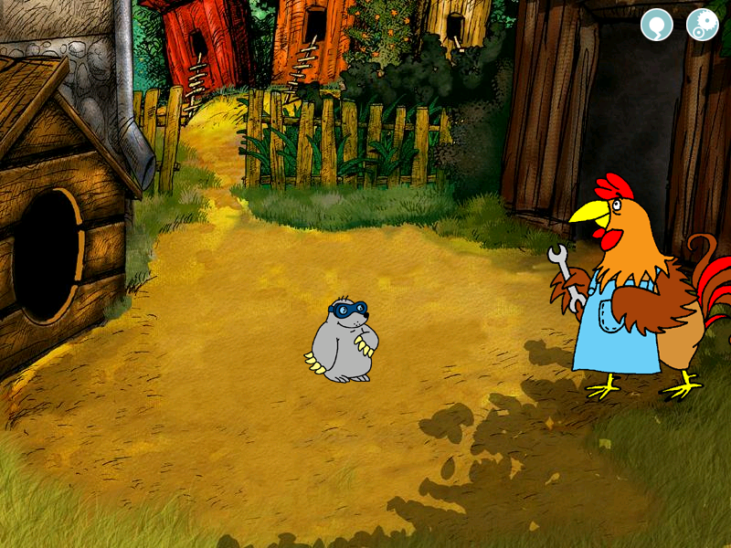
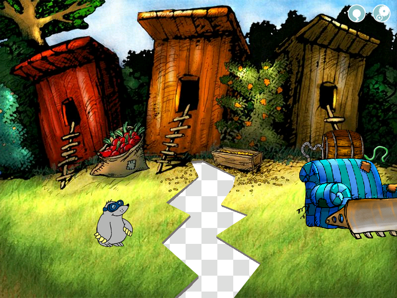
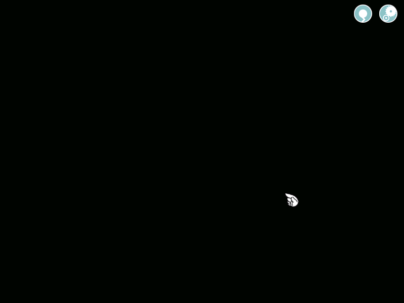

# Warsztaty Kogutów: Modowanie Reksia

Niniejsze repozytorium zawiera bazowy projekt wykorzystany do realizacji warsztatów z modowania Reksia na [Kretesconie 2025](https://www.facebook.com/events/hotel-ior-centrum-kongresowe/kretescon-2025/1845657603047906/). Krótki opis warsztatów na stronie Kretsconu znajduje się [tu](https://kretes-con.pl/program/warsztaty-kogutow-modowanie-reksia/)[^a], a przedstawienie prelegentów [tu](https://kretes-con.pl/prelegenci/dove-i-mysliwy/)[^b].

## Instrukcja

Poniżej krok po kroku opisane są zadania wykonywane na warsztatach tak, by możliwe było ich odtworzenie w domu[^1].

### Potrzebne narzędzia

- edytor Visual Studio Code: https://code.visualstudio.com/
  - rozszerzenie do obsługi plików CNV: https://marketplace.visualstudio.com/items?itemName=dove6.cnv-language
  - rozszerzenie do obsługi plików ARR: https://marketplace.visualstudio.com/items?itemName=dove6.arr-editor
- edytor ANN: https://dove6.github.io/anndrew-gui/
- wybrany edytor grafiki rastrowej, np. GIMP: https://www.gimp.org/
- biblioteka zasobów pochodzących z serii i fangame'ów: https://przybornik-warsztatowicza.github.io/

<details>
<summary>
<h3 style="display: inline">Co należy wiedzieć o edycji skryptów</h3>
</summary>

- Skrypty znajdują się w plikach o rozszerzeniach .cnv, .class oraz .def. Domyślnie są zakodowane szyfrem przesuwnym.
- Gra nie posiada mechanizmu informowania o błędach ani debuggera. Niepoprawny skrypt albo spowoduje **crash**, albo po prostu coś nie będzie działać, jak powinno (i będzie trzeba ręcznie tropić błąd).
- W grze obok przycisku menu znajduje się **restart**. Można go użyć do przeładowania sceny - skrypt zostanie wczytany od nowa, ze zmianami. Podobny efekt można uzyskać poprzez wyjście do menu i powrót do gry albo zmianę planszy na inną i powrót z niej.
- Wygodnie pracuje się z grą w okienku zamiast na pełnym ekranie. Użyj pliku **nemo.bat**, aby uruchomić grę z odpowiednimi opcjami. Alternatywnie możesz skorzystać w wrappera, np. [cnc-ddraw](https://github.com/FunkyFr3sh/cnc-ddraw).
- Podstawy składni skryptów opisane są [tu](https://docs.google.com/spreadsheets/d/1SYI_Gu6MAuSGw-OTXzk_FDWScx29Cc-6eXpc6UfSn1Y/edit?gid=415865205#gid=415865205), a [tutaj](https://docs.google.com/spreadsheets/d/1SYI_Gu6MAuSGw-OTXzk_FDWScx29Cc-6eXpc6UfSn1Y/edit?gid=1909841994#gid=1909841994) znajduje się lista klas obiektów udostępnianych przez silnik gry wraz z ich właściwościami oraz metodami.
- Najważniejsze informacje odnośnie składni są takie:
  - Skrypty są przede wszystkim **deklaratywne**. Każdy plik zawiera listę deklracji obiektów (np. `OBJECT=TU_JAKAS_NAZWA`) oraz ich właściwości (np. `MOJ_OBIEKT:TYPE=INTEGER`, `MOJ_OBIEKT:VALUE=42`).
  - Właściwości mogą być różnego typu, w szczególności mogą zawierać **blok kodu** ograniczony klamrami (`{`, `}`) i zawierający kolejne wywołania metod obiektów (np. `MOJ_OBIEKT^ADD(1, 2);` - zamiast klasycznej kropki mamy daszek).
  - Każda linia pliku to **osobna deklaracja**. Normalnie nie dałoby się więc **rozbić bloków kodu na linie**, bo gra zgubiłaby się po pierwszej instrukcji. Na szczęście okazuje się, że ukośnik (`/`) postawiony **w dowolnym miejscu linii** powoduje zignorowanie najbliższego entera. Dzięki temu następująca linijka:  
    `MOJ_OBIEKT:ONCLICK={ZMIENNA_1^SET([ZMIENNA_2 * ZMIENNA_3]); REKSIO^PLAY("SZCZEKA"); MOJ_OBIEKT^MOVE(5, [0 - 5]);}`  
    równoważna jest nieco czytelniejszej formie:  
    ```cnv
    MOJ_OBIEKT:ONCLICK={ /
        ZMIENNA_1^SET([ZMIENNA_2 * ZMIENNA_3]); /
        REKSIO^PLAY("SZCZEKA"); /
        MOJ_OBIEKT^MOVE(5, [0 - 5]); /
    }
    ```  
    Oczywiście trzeba pamiętać o umieszczeniu ukośnika w każdej linijce - inaczej przygoda zakończy się w najlepszej sytuacji crashem.  
    Trzeba również pamiętać, żeby **nie używać ukośnika** w żadnym innym przypadku. W ścieżkach używa się ukośnika lewego (`\`), który dla odmiany jest całkowicie normalnym znakiem.
- Do komentowania całych linii służy płotek `#`, a do komentowania pojedynczych wywołań metod wykrzyknik `!`, np. `!MOJ_OBIEKT^MOVE(5, [0 - 5]);`. Należy uważać na jednoczesne stosowanie komentarzy całoliniowych i ukośników. Na przykład niniejszy blok kodu spowoduje błąd, ponieważ płotek musi być postawiony na początku linijki, a nie w jej środku (nawet, jeśli jest rozdzielona ukośnikami):  
    ```cnv
    MOJ_OBIEKT:ONCLICK={ /
        # REKSIO^PLAY("SZCZEKA"); /
    }
    ```
- Poza skryptami (Application.def - skrypt główny, .class - skrypty definicji klas użytkownika w common/classes, .cnv - pozostałe), najważniejsze formaty plików to animacje (.ann), grafiki statyczne (.img), przypisanie kwestii mówionych do animacji (.seq, o składni podobnej do .cnv, ale bez kodu), listy danych (.arr) oraz tabele danych (.dta).
- "Reksio i Kapitan Nemo" zawiera wiele systemów nabudowanych na sam silnik. Przykładowo mechanizm swobodnego chodzenia oparty o maski zawarty jest w klasie [CLSWALKER.CLASS](common/classes/CLSWALKER.CLASS). Analogicznie sprawa ma się z systemem zapisów i wczytywania planszy. Przeniesienie 1:1 elementów rozgrywki z "Kapitana Nemo" do wcześniejszych części nie zawsze jest możliwe.

</details>

### 1. Misja z przyniesieniem przedmiotu



https://github.com/user-attachments/assets/1ec6cfac-d28f-4e10-9e52-72cc0641b144

#### 1.1. Umieszczenie przedmiotu na planszy

Dane scen "chodzonych" przechowywane są w odpowiednim katalogu wewnątrz `dane/game/przygoda/arcade`. W tym kroku będziemy zajmować się planszą `podworko`. Jej skrypt główny to [podworko.cnv](dane/game/przygoda/arcade/podworko.cnv), a pliki, z których korzysta, znajdują się w folderze [podworko](dane/game/przygoda/arcade/podworko/).

---

**[TODO: Poniższa część instrukcji nie jest jeszcze gotowa.]**

---

- ANIMO
- musi się nazywać `WAZNY_PRZEDMIOT`
- 800x600

#### 1.2. Dodanie możliwości podniesienia przedmiotu

- inv_items.ann
- kółko ma wymiary ?? x ??, więc trzeba przeskalować przedmiot
- offset -40, -40

Obsługa Koguta jest gotowa - odpowiada za nią poniższy fragment kodu:

```cnv
SKRETTARGETACTIONSEL:ONBRUTALCHANGED^ANNKOGUT={ /
    I1^SET(GSAVE^GET("KOGUT_STAGE")); /
    @IF("SITEMUSED", "_", ""WAZNY_PRZEDMIOT"", "{ /
        INV^REMOVE("WAZNY_PRZEDMIOT"); /
        GSAVE^SET("KOGUT_STAGE", 2); /
        BEHDIALOGPLAY^RUN("KOGUT3", FALSE); /
        I1^SET(-1); /
    }", ""); /
/
...
```

### 2. Modyfikacja ścieżki chodu



https://github.com/user-attachments/assets/09db6ea9-e7c9-4310-bc20-57bbd293882a

#### 2.1. Modyfikacja maski chodu

[paths.ann](dane/game/przygoda/arcade/kurniki/paths.ann)

Nie kombinować z przezroczystością!

"Replace image from disk"

#### 2.2. Modyfikacja grafiki tła*

[paths.ann](dane/game/przygoda/arcade/kurniki/bkg.img)

Usunąć PATHS_IDLE.ARR - gra cache'uje maski.

#### 2.3. Dlaczego Kretes warkocze przy chodzeniu?*

Usunąć PATHS_IDLE.ARR - gra cache'uje maski.

### 3. Dodanie nowej planszy[^2]



https://github.com/user-attachments/assets/87fe6550-98c5-44af-b584-0bd87b218645

#### 3.1. Dodanie nowej planszy

`LAST_ROOM`

#### 3.2. Muzyka w nowej planszy*

obiekt typu `MUSIC`

#### 3.3. Dodanie postaci i dialogu z nią - Kornelek*

`seq`

[^a]: Kopia strony [tu](http://web.archive.org/web/20251112134919/https://kretes-con.pl/program/warsztaty-kogutow-modowanie-reksia/).
[^b]: Kopia strony [tu](http://web.archive.org/web/20251112150331/https://kretes-con.pl/prelegenci/dove-i-mysliwy/).
[^1]: Skoro już o tym mowa... Pamiętaj, żeby pod żadnym pozorem nie wchodzić do *domu*.
[^2]: Ten krok został zrealizowany na warsztatach jedynie częściowo.  
\* Zawartość dodatkowa.
